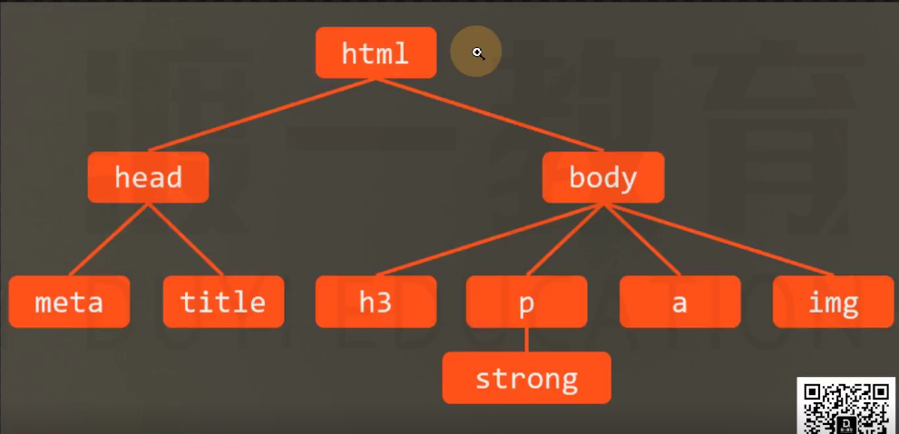

# 属性值的计算过程

- 渲染每个元素的前提，该元素的所有css属性必须有值。

- 一个元素一个元素一次渲染，顺序按照页面文档目录结构的进行。

- 一个元素从所有属性都没有值到所有属性都有值的计算过程叫做：属性值计算过程。

1. 确定声名值：参考样式表没有冲突的声名，直接作为css属性。
2. 层叠冲突：样式表有冲突的属性使用层叠规则，确定css属性值。
3. 使用继承：对仍没有值的属性，若可继承，使用继承元素的值。color:inherit(强制继承)
4. 使用默认值：对仍然没有知道属性，使用默认值。

 特殊的两个属性值：
 - inherit：强制继承
 - initial:恢复初始值

