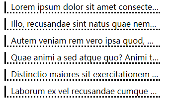

# 盒模型的应用

## 改变宽高范围
问题：衡量设计搞尺寸的时候，往往使用的是边框盒，但设计width和height，是设计内容盒的大小。
解决：
1. 精确计算
2. css3:box-sizing:content-box;(默认值)，改为：         box-sizing:border-box(外边框单位)

## 改变背景覆盖范围
backgroud-clip

## 溢出处理
overflow:内容溢出后的处理方式
overflow:hidden;（隐藏）
overflow:auto;
overflow:scoll;

## 断词规则
断词规则：在文字什么位置被截断
word-break:normal;cjkz字符（英文文字位置截断），非cjk字符（中文单词位置）
word-break:break-all;截断所有，在换行出直接截断
word-break:keep-all;所有都在单词处截断（空格处）

## 空白处理
white-space:nowrap;不换行，配合overflow:hidden;实现隐藏。
white-space:pre;保留所有空格。
text-overflow:ellipsis;文字溢出，使用...代替

```css
li{
    border-left: 3px solid;
    border-bottom: 3px dotted;
    padding-left:10px;
    overflow: hidden;
    width: 300px;
    white-space: nowrap;
    text-overflow: ellipsis;
    margin: 10px;
}
```
