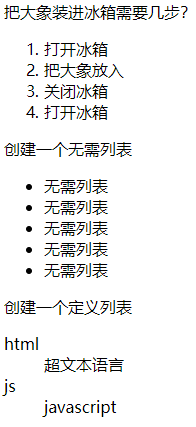

# 列表元素

## 有序列表
ol:order list
li:list item

ol和li组合使用，生成有序列表
```html
    <ol type = "1">
        <li>打开冰箱</li>
        <li>把大象放入</li>
        <li>关闭冰箱</li>
        <li>打开冰箱</li>
    </ol>
```

type属性：序列编号（应由css控制）
reversed属性：序列反转

## 无序列表
ul和li组合适使用生成，常用于制作菜单或列表

## 定义列表
通常用于一些属于的定义

dl元素：definition list
dt元素：definition title
dd元素：definitions descripbtion

## examples
```html
    把大象装进冰箱需要几步？
    <ol type = "1">
        <li>打开冰箱</li>
        <li>把大象放入</li>
        <li>关闭冰箱</li>
        <li>打开冰箱</li>
    </ol>

    创建一个无序列表
    <ul>
        <li>无需列表</li>
        <li>无需列表</li>
        <li>无需列表</li>
        <li>无需列表</li>
        <li>无需列表</li>
    </ul>

    创建一个定义列表
    <dl>
        <dt>html</dt>
        <dd>
            超文本语言
        </dd>

        <dt>js</dt>
        <dd>javascript</dd>
    </dl>
```
